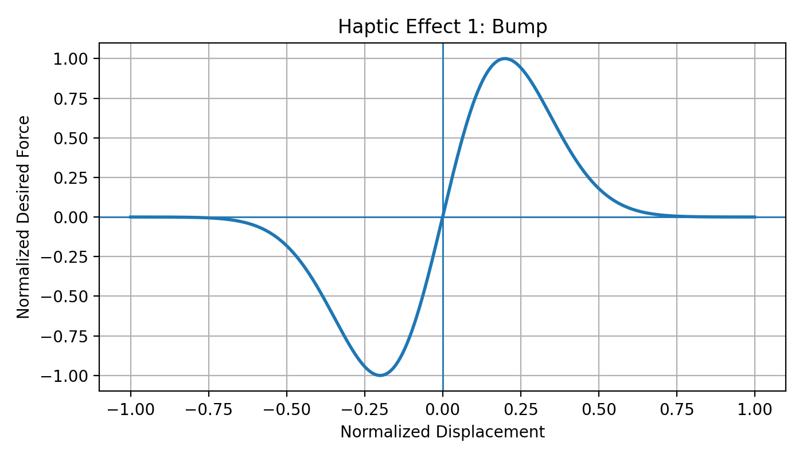
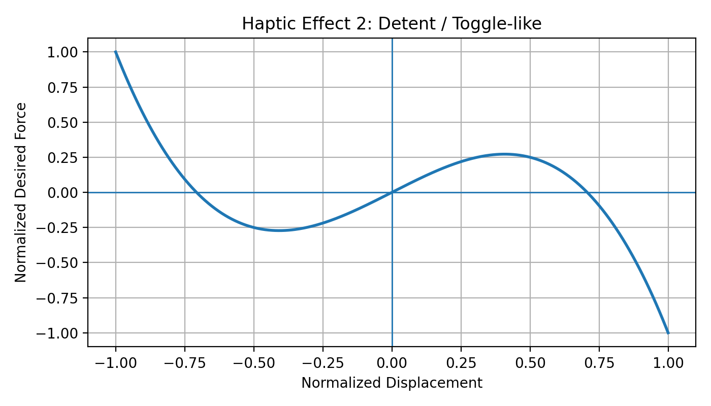
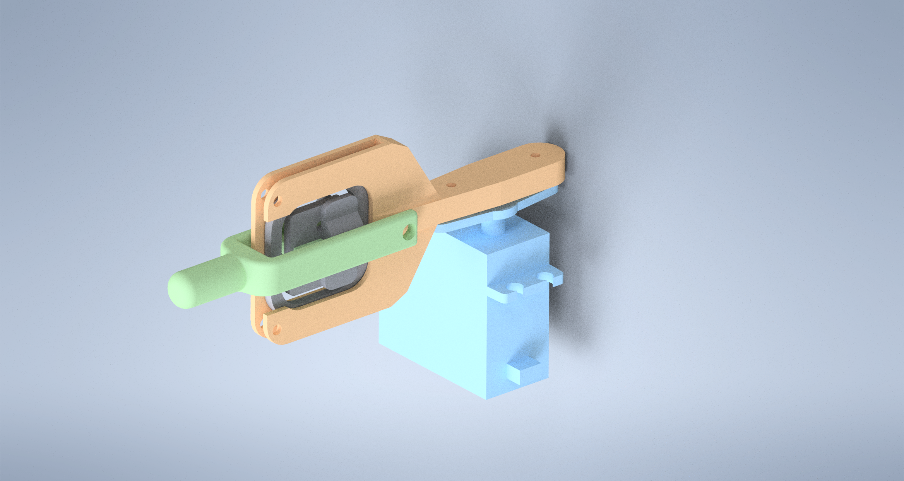
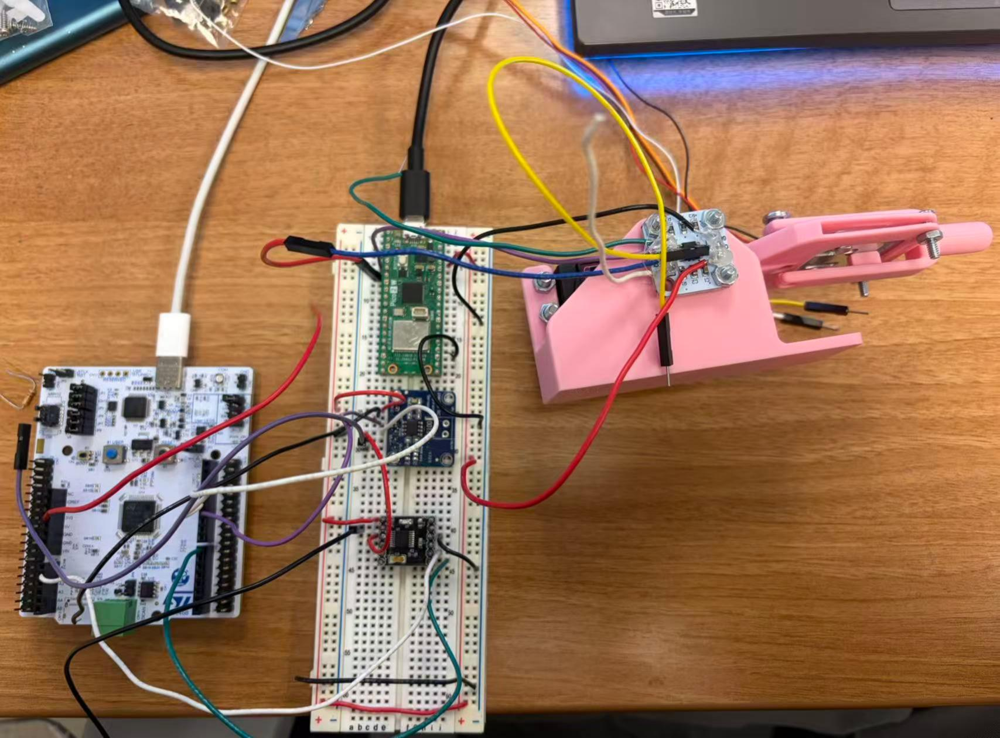
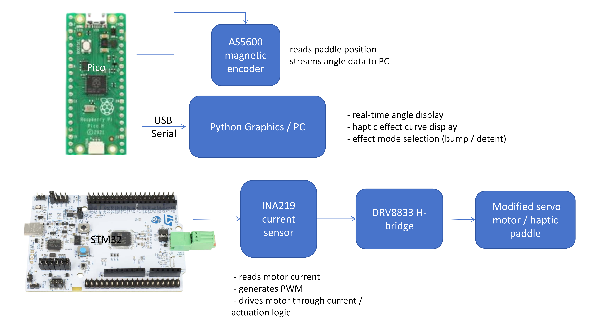
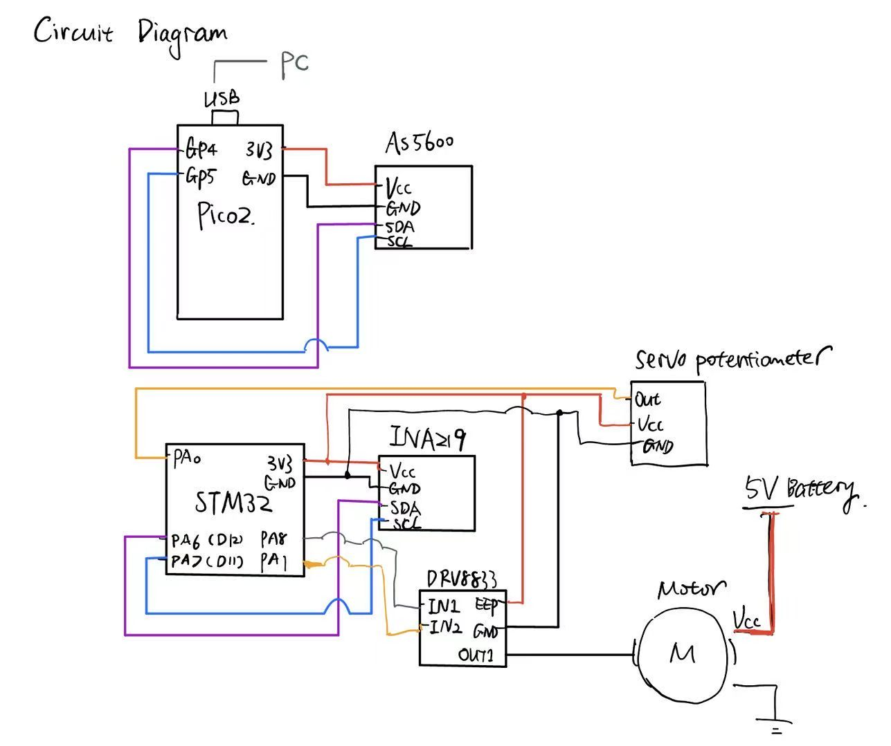
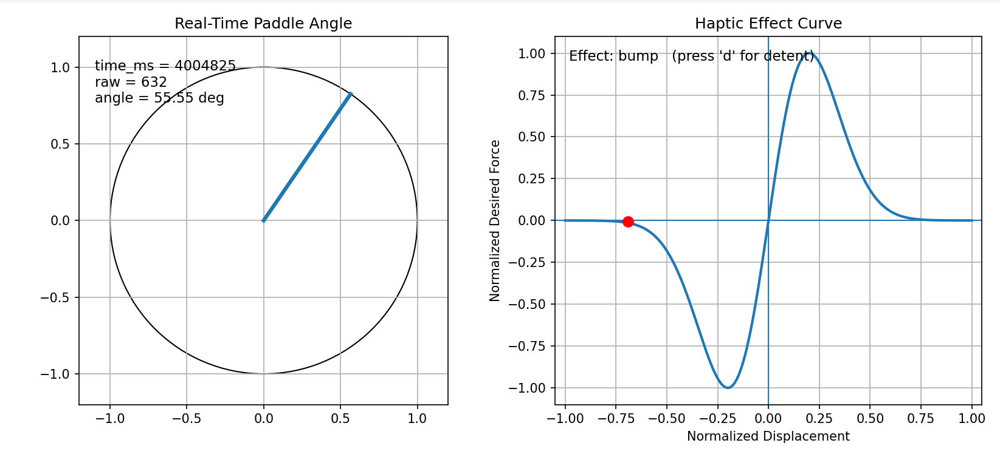
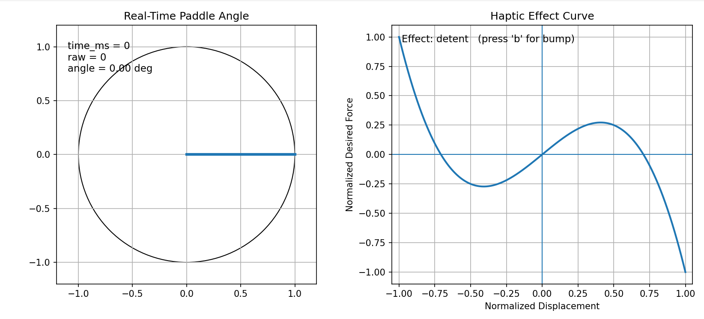

# HW18 – Haptic Paddle Final Integration

## Overview
The goal of HW18 is to put together the haptic paddle system by combining:

- paddle position sensing
- haptic effect design
- motor actuation
- current sensing
- computer graphics visualization

In this project, the system is split across a **Pico** and an **STM32**:

- **Pico** reads the **AS5600 magnetic encoder** and streams paddle angle data to the PC.
- **Python graphics** on the PC display the real-time paddle angle and the selected haptic effect curve.
- **STM32** handles the motor side, including PWM generation and current sensing with the **INA219**.
- The motor is driven through a **DRV8833 H-bridge** and actuates the modified servo-based haptic paddle.

---

## Haptic Effect Design

Two haptic effects were designed and plotted as normalized force-versus-displacement curves:

### 1. Bump effect
This effect creates a local resistance peak when the paddle passes through a specific region.

### 2. Detent / toggle-like effect
This effect creates a detent-like feel similar to a switch or indexed knob.

These curves are used as reference haptic effects for visualization and future control implementation.

---

## Mechanical Design

### Rendered 3D assembly
The following image shows the 3D rendered assembly of the haptic paddle design.

### Physical assembled prototype
The following image shows the physical assembled prototype.

The mechanical system includes:

- modified RC servo motor
- printed paddle structure
- load cell mounting
- AS5600 encoder placement
- magnet placement for angular sensing

This design is based on the previous mechanical iterations and was refined into a more complete integrated prototype for HW18.

---

## System Block Diagram

The block diagram below summarizes the overall architecture of the system.

### Functional description
- **Pico + AS5600** measure paddle position and stream angle data to the PC.
- **Python graphics** display the real-time angle and the selected haptic effect curve.
- **STM32 + INA219 + DRV8833** handle motor actuation and current sensing.
- The **modified servo motor / haptic paddle** provides the mechanical interface.

---

## Circuit Diagram

The following circuit diagram shows the wiring and electrical connections used in the project.

### Main electrical connections
#### Pico side
- AS5600 connected over I2C
- USB serial connection to the PC for streaming angle data

#### STM32 side
- INA219 connected over I2C for current sensing
- DRV8833 used as the motor driver
- servo potentiometer connected for analog feedback
- external battery used for motor power

---

## Real-Time Graphics

A Python visualization program was created to display the paddle state in real time.

### Real-time bump effect display

### Real-time detent effect display

The graphics include:
- real-time paddle angle display
- effect curve visualization
- real-time point tracking on the selected effect curve
- mode switching between bump and detent effects

---

## Code Structure

### Pico code
The `hptic_pico/` folder contains the Pico-side code used to:
- initialize I2C
- read the AS5600 magnetic encoder
- stream angle data to the computer over serial

### Python graphics
The Python visualization code is included in:

- `haptic.py`

This script:
- reads serial data from the Pico
- displays the paddle angle in real time
- shows the selected haptic effect curve
- supports switching between bump and detent modes

### STM32 side
The STM32 side of the project is used for:
- motor PWM generation
- motor current sensing with INA219
- haptic paddle actuation logic

---

## What Was Successfully Implemented

This HW18 submission includes:

- two designed haptic effect curves
- mechanical CAD / rendered assembly
- physical assembled prototype
- system block diagram
- circuit diagram
- Pico-based AS5600 position sensing
- Python real-time graphics for angle and effect display
- a split architecture using both Pico and STM32

---

## Limitations and Future Work

Due to time constraints, not every possible part of the full haptic paddle control pipeline was completed.  
Future improvements would include:

- full closed-loop current control on the STM32
- tighter integration between real-time graphics and motor control
- direct use of haptic effect equations to generate desired current commands
- further refinement of encoder alignment and magnet positioning
- improved mechanical stiffness and packaging

---

## Repository Contents

- `hptic_pico/` – Pico encoder reading code
- `haptic.py` – Python graphics visualization
- `hw18_block_diagram.png`
- `hw18_bump_curve.png`
- `hw18_circuit_diagram.png`
- `hw18_detent_curve.png`
- `hw18_mechanical1.jpg`
- `hw18_mechanical2.png`
- `realtime_effect_bump.png`
- `realtime_effect_detent.png`

---

## Summary
This project demonstrates a partially integrated haptic paddle system that combines:

- mechanical design
- magnetic position sensing
- motor actuation
- current sensing
- haptic effect design
- real-time computer graphics

The submission focuses on building and documenting the complete system architecture while implementing key sensing and visualization components.
